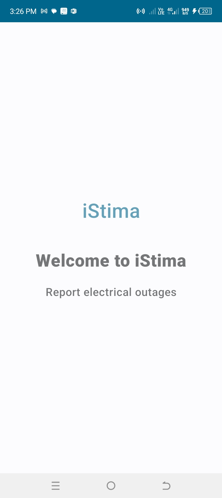
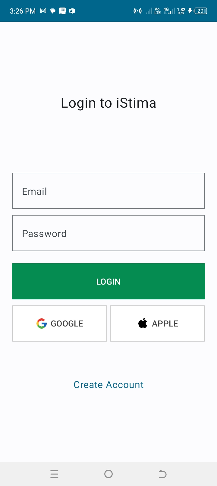
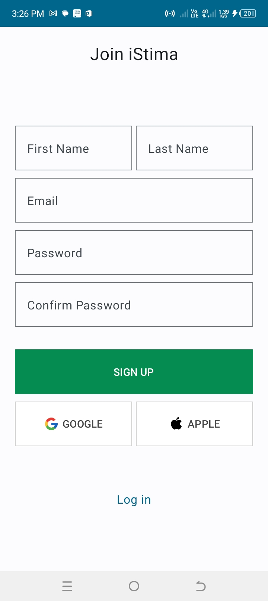
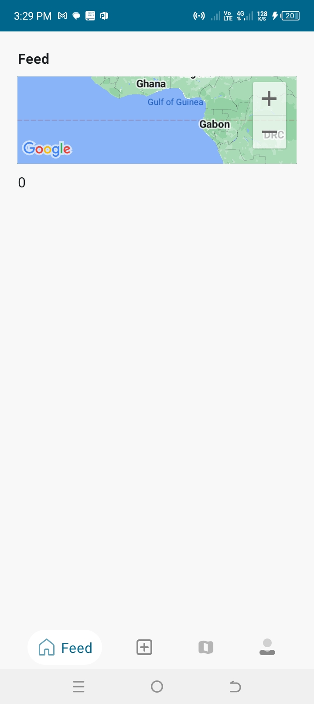
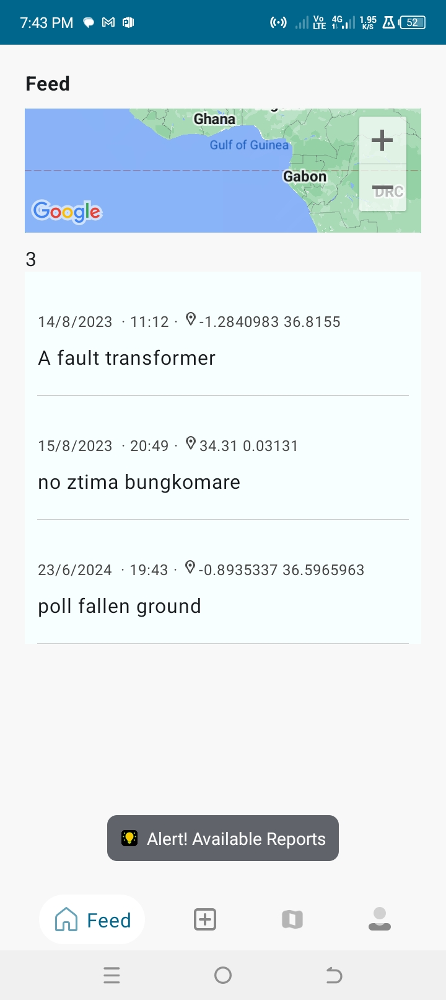
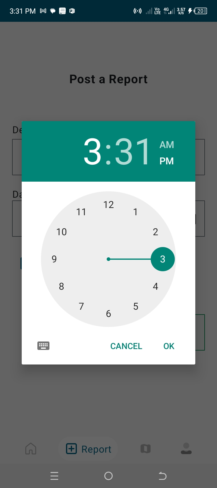
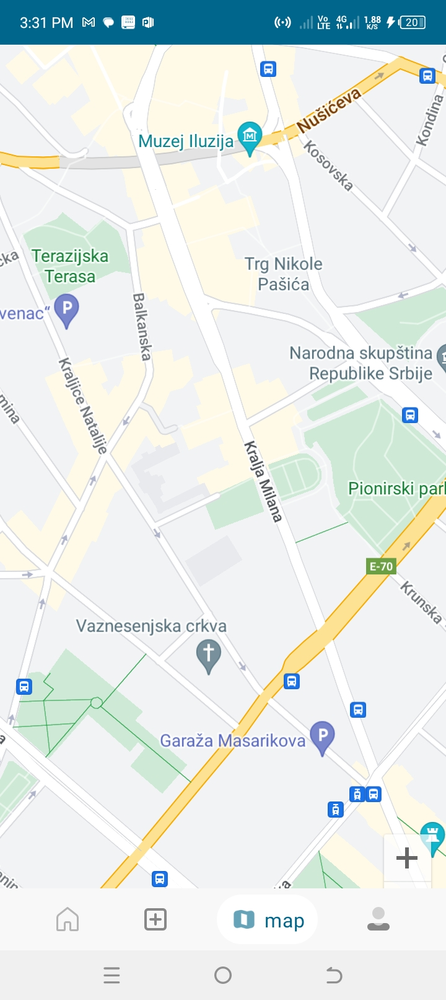

# iStima-Electrical-Outage-Jetpack-Compose

## About this app
> What it does:
- iStima records issue description, location data, date and time and then sends it to Safaricom where we use the data gathered to optimize the KPLC electricity power for the best customer experience.
- You can also report and view location of electrical calamity within the app.

 ### Sample Screenshots
       
      
   
 ## Tech Stack

 ## License

