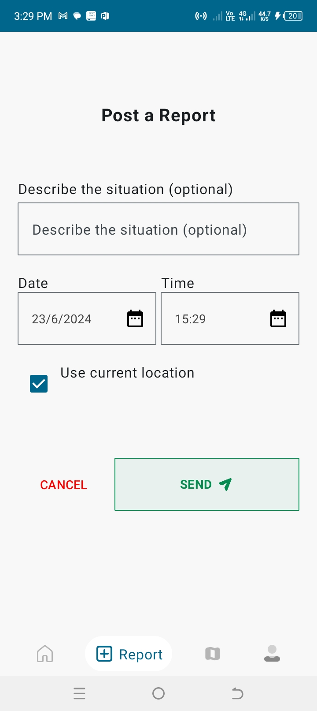

# iStima-Electrical-Outage-Jetpack-Compose

## About this app
> What it does:
- iStima records issue description, location data, date and time and then sends it to the Backend (The other side of the World 😆: ) where we use the data gathered to optimize the KPLC electricity power for the best customer experience.
- You can also report and view location of the electricity power outage within the app.

 ### Sample Screenshots
       
      
   
 ## Tech Stack

 ## License

